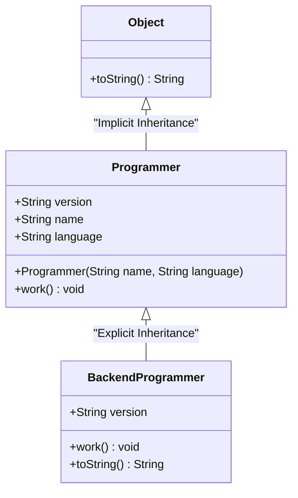

# 자바 개념 정리: 상속, 생성자, 그리고 바인딩 (Solution01)

본 문서는 [Solution01.java](file:///Users/morgan/Documents/workspace/260624_ex/src/Solution01.java)에 구현된 코드를 바탕으로, 자바의 핵심 개념인 **상속(Inheritance)**, **생성자 체이닝(Constructor Chaining)**, **다형성(Polymorphism)**, 그리고 **정적/동적 바인딩**(Static/Dynamic Binding)에 대해 초심자용 설명과 면접대비용 핵심 요약으로 나누어 설명합니다.

---

## 📌 클래스 계층 구조 (Class Hierarchy)

`Solution01.java`에 정의된 클래스 간의 관계는 다음과 같습니다. 자바의 모든 클래스는 암묵적으로 최상위 클래스인 `Object` 클래스를 상속받습니다.



---

## 1️⃣ 초심자용 가이드 (Beginner's Guide)

### 👶 1. 상속(Inheritance)이란 무엇인가요?
상속은 이미 만들어진 클래스(부모/상위 클래스)의 변수와 메서드를 새로운 클래스(자식/하위 클래스)가 그대로 물려받는 것입니다.
* **부모 클래스** (`Programmer`): 기본이 되는 클래스로, 이름(`name`)과 사용 언어(`language`), 그리고 일하기(`work()`) 기능을 가집니다.
* **자식 클래스** (`BackendProgrammer`): 부모의 모든 특성을 물려받은 상태에서, 백엔드 개발자만의 고유한 기능(예: `work()` 메서드의 재정의)을 추가로 가집니다.

### 🧱 2. 생성자(Constructor)와 `super()`
객체가 생성될 때 가장 먼저 호출되는 특별한 메서드가 **생성자**입니다.
* **기본 생성자의 소멸**: 자바에서는 개발자가 생성자를 하나도 만들지 않으면 컴파일러가 아무 내용이 없는 '기본 생성자'를 자동으로 만들어 줍니다. 하지만 `Programmer(String name, String language)` 처럼 **매개변수가 있는 생성자를 직접 정의하면 기본 생성자는 자동으로 만들어지지 않습니다.**
* **부모 생성자 호출** (`super`): 자식 클래스의 인스턴스를 만들 때, 내부적으로 부모 클래스의 멤버들도 초기화되어야 합니다. 따라서 자식 생성자의 첫 줄에는 반드시 부모 생성자를 호출하는 `super(...)`가 와야 합니다.

### 🎭 3. 다형성(Polymorphism)과 변수 선언
자바에서는 부모 타입의 변수로 자식 객체를 가리킬 수 있습니다. 이를 **업캐스팅**(Upcasting)이라고 합니다.
```java
// Programmer(부모) 타입의 변수 programmer2가 BackendProgrammer(자식) 객체를 가리킴
Programmer programmer2 = new BackendProgrammer("John", "Java");
```
이 상태에서 변수를 사용할 때, **멤버 변수**(필드)에 접근하는 것과 **메서드**를 호출하는 것의 동작이 다릅니다. 이 차이를 이해하는 것이 자바의 핵심입니다!

---

## 2️⃣ 면접대비용 심화 가이드 (Interview Prep)

### 💻 핵심 개념 비교 요약

| 구분 | 정적 바인딩(Static Binding) | 동적 바인딩(Dynamic Binding) |
| :--- | :--- | :--- |
| **정의** | 컴파일 시점에 참조할 대상(메서드/변수)이 결정됨 | 실행 시점(Runtime)에 실제 객체 타입을 확인하고 참조 대상을 결정함 |
| **적용 대상** | **멤버 변수**(필드), `static` 메서드, `private` 메서드, `final` 메서드 | **오버라이딩된 일반 메서드** |
| **결정 기준** | 변수의 **선언된 타입**(Declared Type) | 실제 메모리에 할당된 **실제 객체 타입**(Actual Object Type) |
| **코드 예시** | `programmer2.version` ➡️ `Programmer` 클래스의 `"1.0"` 반환 | `programmer2.work()` ➡️ `BackendProgrammer` 객체의 `work()` 실행 |

---

### 🔥 주요 면접 질문 & 모범 답변 (Q&A)

#### Q1. 부모 클래스에 매개변수가 있는 생성자만 존재할 때, 자식 클래스에서 발생할 수 있는 컴파일 에러와 해결책은 무엇인가요?
**A1.**
자바에서 자식 클래스의 생성자가 호출될 때, 첫 줄에 명시적으로 `super(...)`를 호출하지 않으면 컴파일러는 자동으로 부모의 기본 생성자인 `super()`를 호출하려 시도합니다.
이때 부모 클래스에 매개변수가 있는 생성자가 직접 정의되어 있어 **기본 생성자가 존재하지 않는다면**, 컴파일러는 `super()` 호출처에서 **컴파일 에러**를 발생시킵니다.
이를 해결하려면 자식 클래스 생성자에서 `super(name, language)`와 같이 부모의 생성자 시그니처에 맞는 인자를 넘겨주어 명시적으로 부모 생성자를 호출해야 합니다.

#### Q2. `Programmer p = new BackendProgrammer("John", "Java");`가 실행되었을 때, `p.version`과 `p.work()`의 결과는 각각 무엇이며 그 이유는 무엇인가요?
**A2.**
* `p.version`은 "**1.0**"입니다.
* `p.work()`는 "**John은 Java로 백엔드 프로그래밍을 합니다.**"를 출력합니다.

**이유:**
자바에서 **멤버 변수**(필드)는 다형성이 적용되지 않으며 **정적 바인딩**(Static Binding)을 따릅니다. 따라서 컴파일러는 변수 `p`의 선언 타입인 `Programmer` 클래스에 정의된 `version` 필드를 연결하므로 `"1.0"`이 반환됩니다.
반면, **일반 인스턴스 메서드**는 **동적 바인딩**(Dynamic Binding)을 따릅니다. 런타임에 변수 `p`가 가리키는 실제 인스턴스인 `BackendProgrammer` 클래스에서 재정의된(Overridden) `work()` 메서드를 호출하므로 자식 클래스의 메시지가 출력됩니다.

#### Q3. `@Override` 어노테이션의 역할과 컴파일 에러 예시(`work2()`)에 대해 설명해주세요.
**A3.**
`@Override` 어노테이션은 해당 메서드가 부모 클래스의 메서드를 오버라이딩(재정의)하고 있음을 컴파일러에게 명시적으로 알리는 역할을 합니다. 
컴파일러는 이 어노테이션이 붙은 메서드가 실제로 부모 클래스에 존재하는지 검증합니다. 만약 부모 클래스에 존재하지 않는 메서드(예: 오타가 나거나 새롭게 작성한 `work2()`)에 `@Override`를 붙이면, 컴파일러가 이를 감지하여 **컴파일 에러**를 발생시킴으로써 개발자의 실수를 사전에 예방합니다.

#### Q4. 자바의 모든 클래스가 `Object` 클래스를 상속받는 이점과 `toString()` 재정의의 의의는 무엇인가요?
**A4.**
자바의 모든 클래스가 `java.lang.Object`를 상속받음으로써 모든 객체는 공통적인 API(예: `equals()`, `hashCode()`, `toString()`, `getClass()` 등)를 가질 것을 보장받으며, 다형성을 활용해 모든 객체를 `Object` 타입으로 일관되게 다룰 수 있습니다.
`Object` 클래스의 기본 `toString()`은 `클래스명@해시코드`를 반환하므로 식별하기 어렵습니다. 클래스 내에서 `toString()`을 오버라이딩하여 내부 필드 정보(예: `name`, `language`)를 가독성 있는 문자열 형식으로 재정의하면, 디버깅 및 로그 출력 시 객체의 상태를 직관적으로 파악할 수 있게 됩니다.
