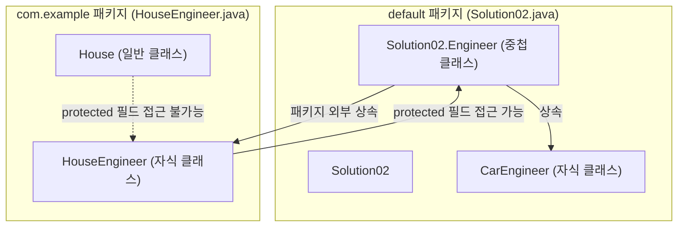

# 자바 개념 정리: 접근 제어자, 메서드 오버라이딩과 바인딩의 함정 (Solution02)

본 문서는 [Solution02.java](file:///Users/morgan/Documents/workspace/260624_ex/src/Solution02.java) 및 [HouseEngineer.java](file:///Users/morgan/Documents/workspace/260624_ex/src/com/example/HouseEngineer.java)의 코드를 바탕으로, 자바의 **접근 제어자(Access Modifiers), 메서드 오버라이딩 규칙, 그리고 private 메서드와 관련된 바인딩 함정**에 대해 초심자용 설명과 면접대비용 핵심 요약으로 나누어 설명합니다.

---

## 📌 구조 및 상속 관계 (Structure & Inheritance)

패키지와 클래스 간의 관계 및 접근 권한의 흐름은 다음과 같습니다.



---

## 1️⃣ 초심자용 가이드 (Beginner's Guide)

### 🔒 1. 접근 제어자(Access Modifier)란 무엇인가요?
클래스, 변수, 메서드 등에 대해 **외부에서 접근할 수 있는 범위**를 제한하는 자바의 문법입니다. 자바에는 4가지 수준의 접근 제어자가 있습니다.

| 접근 제어자 | 클래스 내부 | 동일 패키지 | 상속받은 자식 클래스 (패키지 무관) | 전체 공개 |
| :--- | :---: | :---: | :---: | :---: |
| **`public`** | ✅ | ✅ | ✅ | ✅ |
| **`protected`** | ✅ | ✅ | ✅ | ❌ |
| **`default` (선언 생략)** | ✅ | ✅ | ❌ | ❌ |
| **`private`** | ✅ | ❌ | ❌ | ❌ |

* **실제 예시 (`HouseEngineer.java`)**: 
  `Solution02.Engineer`에 선언된 `protected String value`는 다른 패키지(`com.example`)에 있는 자식 클래스인 `HouseEngineer` 내부에서는 접근할 수 있습니다. 반면, 자식이 아닌 일반 클래스인 `House`에서는 접근을 시도하면 컴파일 에러가 발생합니다.

### 🔄 2. 메서드 오버라이딩(Overriding)의 접근 권한 규칙
자식 클래스가 부모의 메서드를 재정의(오버라이딩)할 때, **부모 메서드보다 접근 제어자를 더 좁은 범위로 변경할 수 없습니다.**
* **허용되는 예**: 부모가 `default`로 선언한 `work()` 메서드를 자식이 `public void work()`로 범위를 더 넓혀 오버라이딩하는 것은 가능합니다.
* **허용되지 않는 예**: 부모의 `default void work()`를 자식에서 `private void work()`로 오버라이딩하려고 하면 컴파일 에러가 발생합니다.

---

## 2️⃣ 면접대비용 심화 가이드 (Interview Prep)

### 💻 private 메서드와 동적 바인딩의 한계 (핵심 함정 분석)

`Solution02.java` 코드를 보면 가장 헷갈리기 쉬운 자바의 바인딩 원리가 숨겨져 있습니다.

```java
// 부모 클래스 (Engineer)
public static class Engineer {
    void work() {
        System.out.println("this.getVersion() = " + this.getVersion());
    }
    private String getVersion() { // private 메서드
        return "1.0";
    }
}

// 자식 클래스 (CarEngineer)
class CarEngineer extends Solution02.Engineer {
    private String getVersion() { // 오버라이딩이 아님! (부모 클래스에서는 이 메서드가 안 보임)
        return "2.0";
    }
}
```

#### ❓ 다형성 호출 시의 결과 분석

```java
Engineer e3 = new CarEngineer();
e3.work();
```
* **동작 및 출력 결과:** `"this.getVersion() = 1.0"`이 출력됩니다.
* **오해하기 쉬운 부분:** `e3`의 실제 객체는 `CarEngineer`이므로 `this.getVersion()` 호출 시 `CarEngineer`의 `getVersion()`인 `"2.0"`이 호출되어야 할 것 같지만, 그렇지 않습니다.

---

### 🔥 주요 면접 질문 & 모범 답변 (Q&A)

#### Q1. `Engineer e3 = new CarEngineer(); e3.work();`를 실행했을 때 `CarEngineer`의 `getVersion()`이 아닌 `Engineer`의 `getVersion()`이 실행되어 `1.0`이 출력되는 이유는 무엇인가요?
**A1.**
`private` **메서드는 오버라이딩 대상이 아니며, 정적 바인딩(Static Binding)되기 때문**입니다.
`private` 접근 제어자가 붙은 메서드는 선언된 클래스 내부에서만 보이며 자식 클래스에 상속되지 않습니다. 따라서 `CarEngineer`에 정의된 `private String getVersion()`은 부모의 메서드를 오버라이딩한 것이 아니라, 우연히 이름이 같은 완전히 새로운 독립된 메서드일 뿐입니다.
부모 클래스의 `work()` 메서드는 `Engineer` 클래스 내부에서 컴파일될 때, 자신이 가지고 있는 `private getVersion()`을 호출하도록 컴파일 타임에 결정(정적 바인딩)됩니다. 런타임에 실제 인스턴스가 `CarEngineer`이더라도 `work()` 메서드 내부의 `private` 메서드 호출 위치는 동적으로 바인딩되지 않으므로 `1.0`이 출력됩니다.

#### Q2. 만약 부모 클래스인 `Engineer`의 `getVersion()`을 `private`에서 `protected` 또는 `default`로 변경하면 출력 결과가 어떻게 달라지나요?
**A2.**
출력 결과가 **"2.0"**으로 변경됩니다.
부모 클래스의 `getVersion()` 메서드가 `protected` 혹은 패키지 권한(`default`)이 되면 자식 클래스로 상속되며, 자식 클래스(`CarEngineer`)의 `getVersion()`은 부모의 메서드를 정상적으로 **오버라이딩(Overriding)**하게 됩니다. 이 경우 인스턴스 메서드로서 **동적 바인딩(Dynamic Binding)**이 적용되므로, 런타임 시점에 실제 인스턴스인 `CarEngineer` 객체에 재정의된 `getVersion()` 메서드가 호출되어 `2.0`이 출력됩니다.

#### Q3. 자식 클래스에서 오버라이딩을 할 때 접근 제어자를 부모보다 더 좁은 범위로 선언할 수 없는 이유는 다형성 관점에서 무엇인가요?
**A3.**
자바의 다형성 대원칙 중 하나인 **리스코프 치환 원칙(Liskov Substitution Principle, LSP)**을 지키기 위해서입니다.
부모 타입 변수(예: `Engineer e`)는 언제나 자식 객체(`CarEngineer`)를 가리킬 수 있어야 하고, 부모 타입에 정의된 인터페이스 규격(예: `work()`)대로 호출할 수 있어야 합니다. 만약 자식 클래스에서 오버라이딩을 통해 접근 권한을 `private`으로 좁히는 것을 허용한다면, 부모 타입 변수를 통해 객체에 접근할 때 런타임에 접근할 수 없는 심각한 런타임 에러나 불일치가 발생하게 됩니다. 따라서 컴파일러 수준에서 접근 범위를 제한하는 것을 금지합니다.
