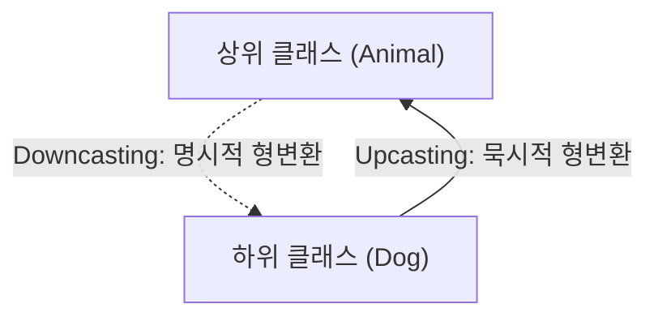

# 자바 개념 정리: 업캐스팅, 다운캐스팅, 그리고 instanceof (Solution03)

본 문서는 [Solution03.java](file:///Users/morgan/Documents/workspace/260624_ex/src/Solution03.java)에 구현된 코드를 바탕으로, 자바의 핵심 개념인 **업캐스팅**(Upcasting), **다운캐스팅**(Downcasting), 그리고 **타입 검사**(instanceof 및 패턴 매칭)에 대해 초심자용 설명과 면접대비용 핵심 요약으로 나누어 설명합니다.

---

## 📌 상속 관계 및 타입 캐스팅 (Type Casting)

`Animal`과 `Dog` 클래스의 상속 관계와 타입 캐스팅 방향은 다음과 같습니다.



---

## 1️⃣ 초심자용 가이드 (Beginner's Guide)

### ⬆️ 1. 업캐스팅이란 무엇인가요?
하위 클래스 타입의 객체를 상위 클래스 타입의 변수에 대입하는 것을 의미합니다.
* **묵시적(암시적) 변환**: 특별한 형변환 기호 없이 자동으로 수행됩니다.
* **안전성**: 하위 객체(개)는 상위 객체(동물)의 모든 특성을 이미 가지고 있으므로 항상 안전합니다.
```java
Animal a = new Dog(); // Dog 객체가 Animal 타입 변수에 자동으로 대입됨
```

### ⬇️ 2. 다운캐스팅이란 무엇인가요?
업캐스팅된 객체를 다시 원래의 하위 클래스 타입으로 되돌리는 것을 의미합니다.
* **명시적 변환**: 변환하고자 하는 타입을 괄호 안에 지정해주어야 합니다.
* **위험성**: 실제 메모리에 해당 자식 객체가 없는데 억지로 형변환을 시도하면 실행 중에 프로그램이 강제 종료됩니다.
```java
Dog d = (Dog) a; // 명시적 변환 필요
```

### 🔍 3. 안전하게 변환하는 법 (instanceof)
자바에서는 객체가 특정 클래스의 인스턴스인지를 미리 확인한 후 형변환을 진행하는 `instanceof` 키워드를 제공합니다.
```java
if (a2 instanceof Dog) {
    Dog d2 = (Dog) a2; // 안전한 변환 가능
    d2.eat();
}
```

---

## 2️⃣ 면접대비용 심화 가이드 (Interview Prep)

### 💻 캐스팅 방식 비교 요약

| 구분 | 업캐스팅(Upcasting) | 다운캐스팅(Downcasting) |
| :--- | :--- | :--- |
| **변환 방향** | 자식 클래스 ➡️ 부모 클래스 | 부모 클래스 ➡️ 자식 클래스 |
| **형변환 기호** | 생략 가능 (묵시적) | 필수 작성 (명시적) |
| **메모리 특징** | 실제 힙 메모리 객체 규격의 일부(부모 부분)만 참조함 | 힙 메모리에 인접한 자식 객체 영역까지 모두 참조할 수 있게 복원함 |
| **위험성** | 에러 가능성 없음 (100% 안전) | `ClassCastException` 발생 가능성 있음 (런타임 에러) |

---

### 🔥 주요 면접 질문 & 모범 답변 (Q&A)

#### Q1. 다운캐스팅을 진행할 때 발생하는 ClassCastException이란 무엇이며, 왜 발생하나요?
**A1.**
`ClassCastException`은 서로 호환되지 않는 타입으로 객체를 강제 형변환(Downcasting)하려고 할 때 런타임에 발생하는 예외입니다.
예를 들어, `Animal a = new Animal();`과 같이 힙 메모리에 실제 `Dog` 객체가 존재하지 않고 오직 `Animal` 객체만 생성된 상태에서 `(Dog) a`를 시도하는 경우에 발생합니다. 참조 변수의 타입은 캐스팅을 통해 속일 수 있지만, 실제 힙 영역에 존재하지 않는 자식 객체의 메모리 영역(변수 및 메서드 테이블)에는 접근할 수 없기 때문에 JVM이 즉시 예외를 발생시키며 프로그램을 정지합니다.

#### Q2. instanceof 키워드의 힙 메모리 관점 동작 원리와 JDK 16에 추가된 패턴 매칭에 대해 설명해 주세요.
**A2.**
`instanceof`는 실제 힙 메모리에 생성되어 있는 인스턴스의 타입(RTTI - Run-Time Type Information)을 검사하여 참/거짓을 반환합니다.
이후 명시적 변환을 수작업으로 진행해야 하던 번거로움을 해결하기 위해 JDK 16부터 **패턴 매칭**(Pattern Matching for instanceof)이 정식 도입되었습니다.
```java
if (a instanceof Dog dd) {
    dd.eat(); // 명시적 캐스팅 코드 없이 변수 dd를 바로 사용 가능
}
```
이 방식은 `instanceof` 검사와 동시에 타입 변환을 결합하여 가독성을 높이고 형변환 실수를 완전히 방지할 수 있습니다.
