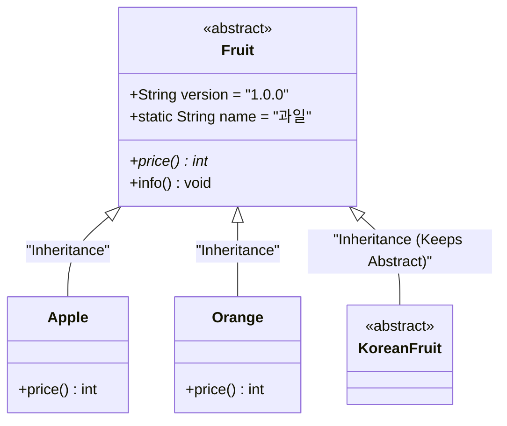

# 자바 개념 정리: 추상 클래스와 추상 메서드 (Solution04)

본 문서는 [Solution04.java](file:///Users/morgan/Documents/workspace/260624_ex/src/Solution04.java)에 구현된 코드를 바탕으로, 자바의 핵심 개념인 **추상 클래스**(Abstract Class), **추상 메서드**(Abstract Method), 그리고 **상속 관계에서의 추상화 유지**에 대해 초심자용 설명과 면접대비용 핵심 요약으로 나누어 설명합니다.

---

## 📌 추상 클래스 구조 (Abstract Class Hierarchy)

`Fruit` 추상 클래스와 하위 구현 클래스들의 관계는 다음과 같습니다.

---

## 1️⃣ 초심자용 가이드 (Beginner's Guide)

### 🧱 1. 추상 클래스(Abstract Class)란 무엇인가요?
직접 객체를 생성(인스턴스화)할 수 없는 설계도 성격의 특별한 클래스입니다.
* **인스턴스 생성 불가**: `new Fruit()`와 같이 단독으로 객체를 만들려고 하면 컴파일 에러가 발생합니다.
* **목적**: 공통된 속성(필드)과 행동(메서드)을 정의해 두고, 하위 클래스들(`Apple`, `Orange`)이 이를 물려받아 상세히 채우도록 강제하기 위해 사용합니다.

### ⚙️ 2. 추상 메서드(Abstract Method)란 무엇인가요?
구현체(메서드 몸체 `{ }`)가 없이 선언만 존재하는 메서드입니다.
* **강제성**: 하위 구현 클래스는 반드시 이 추상 메서드를 오버라이딩하여 구체적인 코드를 채워 넣어야만 합니다. (예: `price()` 메서드는 `Apple`과 `Orange`에서 직접 몸체를 구현함)
* **일반 메서드와 공존**: 추상 클래스 안에는 추상 메서드뿐만 아니라 이미 동작이 구현된 일반 메서드(`info()`)도 함께 존재할 수 있습니다.

### 🌾 3. 추상 클래스를 상속받는 추상 클래스 (KoreanFruit)
부모 추상 클래스를 상속받더라도 구현 책임을 바로 지고 싶지 않다면, 자식 클래스 자체를 다시 `abstract`로 선언하여 구현 책임을 한 단계 아래로 미룰 수 있습니다.

---

## 2️⃣ 면접대비용 심화 가이드 (Interview Prep)

### 💻 추상 클래스 vs 일반 클래스 비교 요약

| 구분 | 일반 클래스(Concrete Class) | 추상 클래스(Abstract Class) |
| :--- | :--- | :--- |
| **객체 생성** | `new` 키워드로 즉시 생성 가능 | `new` 키워드로 직접 생성 불가능 |
| **추상 메서드 포함 여부** | 포함할 수 없음 | 포함할 수 있음 (필수는 아님) |
| **공통 규격 정의** | 가능 (상속 활용) | 하위 클래스에 필수 구현을 강력하게 강제함 |
| **용도** | 실질적으로 비즈니스 로직을 수행할 객체 | 상속 구조에서 계층을 만들고 규격을 선언할 설계용 |

---

### 🔥 주요 면접 질문 & 모범 답변 (Q&A)

#### Q1. 추상 클래스(Fruit) 내부에 정의된 변수(version, static name)는 자식 클래스에 어떻게 상속되고 공유되나요?
**A1.**
* **인스턴스 변수** (`version`): 부모인 `Fruit`에 정의된 `version` 필드는 하위 객체(`Apple`, `Orange`)가 메모리에 인스턴스화될 때 함께 힙에 로드되며 상속받은 모든 인스턴스가 독립적으로 참조를 가집니다.
* **클래스 변수** (`static name`): `static`으로 정의된 변수는 힙 영역이 아닌 JVM의 **메서드 영역**(Method Area)에 단 하나만 생성되어 메모리를 절약하고 모든 자식 클래스 및 객체가 전역적으로 값을 공유합니다.

#### Q2. KoreanFruit 클래스가 Fruit 클래스를 상속받을 때, price() 메서드를 재정의하지 않아도 컴파일 에러가 발생하지 않는 이유는 무엇인가요?
**A2.**
`KoreanFruit` 역시 클래스 제어자가 `abstract`로 지정된 **추상 클래스**이기 때문입니다.
자바 규격상 일반(Concrete) 클래스가 추상 클래스를 상속받을 때는 즉시 부모의 모든 추상 메서드를 재정의할 의무가 있지만, 자식도 추상 클래스인 경우에는 이 의무를 면제받습니다. 이 경우 구현 책임은 `KoreanFruit`를 상속받을 미래의 하위 구체 클래스(예: `KoreanApple` 등)로 한 단계 위임(지연)됩니다.
