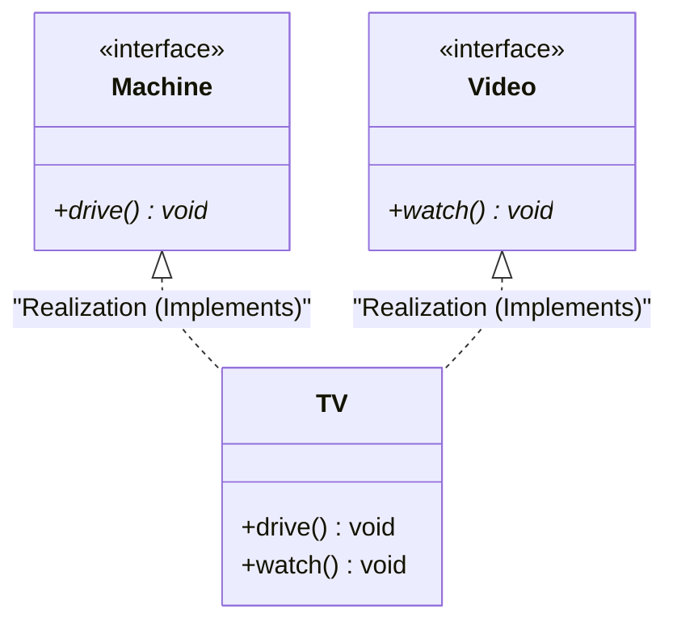

# 자바 개념 정리: 인터페이스와 다중 구현 (Solution05)

본 문서는 [Solution05.java](file:///Users/morgan/Documents/workspace/260624_ex/src/Solution05.java)에 구현된 코드를 바탕으로, 자바의 핵심 개념인 **인터페이스**(Interface), **다중 구현**(Multiple Implementation), 그리고 **인터페이스 타입 업캐스팅**에 대해 초심자용 설명과 면접대비용 핵심 요약으로 나누어 설명합니다.

---

## 📌 인터페이스 구현 구조 (Interface Implementation)

`TV` 클래스가 두 개의 인터페이스(`Machine`, `Video`)를 다중 구현하는 관계는 다음과 같습니다.



---

## 1️⃣ 초심자용 가이드 (Beginner's Guide)

### 🔌 1. 인터페이스(Interface)란 무엇인가요?
클래스가 어떤 동작(메서드)을 해야 하는지 계약(스펙)을 규정하는 약속판입니다.
* **추상 메서드만 선언**: 모든 일반적인 메서드는 구현체 `{ }` 없이 이름과 선언만 존재합니다.
* **상태 필드 불가**: 객체의 상태를 나타내는 멤버 변수를 가질 수 없습니다.

### 🔗 2. 다중 구현(Multiple Implementation)의 이점
자바는 클래스 상속 시 단 하나의 부모 클래스만 상속받을 수 있지만(단일 상속), **인터페이스는 무제한으로 여러 개를 동시에 구현(다중 구현)**할 수 있습니다.
```java
// Machine과 Video의 약속을 모두 구현하겠다는 선언
class TV implements Machine, Video { ... }
```

### 🎭 3. 인터페이스 변수로의 업캐스팅과 시야 제한
인터페이스 타입으로 업캐스팅되면, 실제 인스턴스가 가진 전체 기능 중에서 **해당 인터페이스에 정의된 기능만 보이고 사용할 수 있습니다.**
```java
TV tv = new TV();
Machine m = tv; // 업캐스팅
m.drive();      // 호출 가능
// m.watch();   // Machine 타입 변수로는 watch() 메서드를 볼 수 없어 에러 발생!
```

---

## 2️⃣ 면접대비용 심화 가이드 (Interview Prep)

### 💻 추상 클래스 vs 인터페이스 비교 요약

| 구분 | 추상 클래스(Abstract Class) | 인터페이스(Interface) |
| :--- | :--- | :--- |
| **상속/구현 키워드** | `extends` | `implements` |
| **상속/구현 한계** | 단일 상속만 가능 (클래스 구조의 제약) | 다중 구현 가능 (자유로운 계약 조합) |
| **인스턴스 멤버 변수** | 선언 가능 (객체의 상태를 저장할 수 있음) | 선언 불가능 (오직 `public static final` 상수만 허용) |
| **디폴트 구현** | 일반 메서드 구현 가능 | JDK 8부터 `default` 메서드를 통해 제한적 구현 허용 |
| **사용 목적** | 타입 확장 및 강한 상속 관계로 공통 조상을 묶을 때 | 클래스 계층에 상관없이 특정 행위를 보장하는 구현 스펙을 선언할 때 |

---

### 🔥 주요 면접 질문 & 모범 답변 (Q&A)

#### Q1. 자바에서 클래스의 다중 상속은 불가능하지만, 인터페이스의 다중 구현은 가능한 이유는 무엇인가요?
**A1.**
클래스의 다중 상속을 허용하면 다중 부모에 동일한 메서드 이름이 존재할 경우 충돌이 생겨 JVM이 어떤 부모의 메서드를 실행해야 할지 모르는 **다이아몬드 문제**(Diamond Problem)가 발생하며, 부모 상태(필드) 충돌로 인해 객체 무결성이 깨집니다.
반면, 인터페이스는 필드(상태)를 가질 수 없고 메서드는 오직 구현이 없는 선언만 존재하므로, 자식 클래스에서 어차피 단 한 번 오버라이딩하여 메서드를 구현하게 됩니다. 따라서 호출에 충돌이나 모호함이 발생하지 않으므로 안전하게 다중 구현을 지원할 수 있습니다.

#### Q2. "인터페이스는 힙 영역에 직접 접근하지 않는다"라는 표현의 뜻과 그에 따른 힙 메모리 구조 특징을 설명해 주세요.
**A2.**
인터페이스 내부에는 객체의 개별 상태를 동적으로 할당하고 변경할 수 있는 **인스턴스 멤버 변수가 존재하지 않는다**는 뜻입니다.
인터페이스 타입 변수(예: `Machine m`)를 통해 인스턴스에 접근하더라도 인터페이스 자체는 가상 메서드 테이블(Virtual Method Table)을 가리키는 포인터 규격을 가질 뿐, 객체의 실제 인스턴스 변수 데이터가 보관되어 있는 힙 영역의 독립 메모리 세부 구조를 직접 지정하거나 제한하지 않습니다. 이를 통해 객체 상태 관리 책임은 오직 실제 클래스(`TV`)에 두고, 인터페이스는 순수하게 규격 계약(Behavior Contract) 역할만 분리해 낼 수 있습니다.
